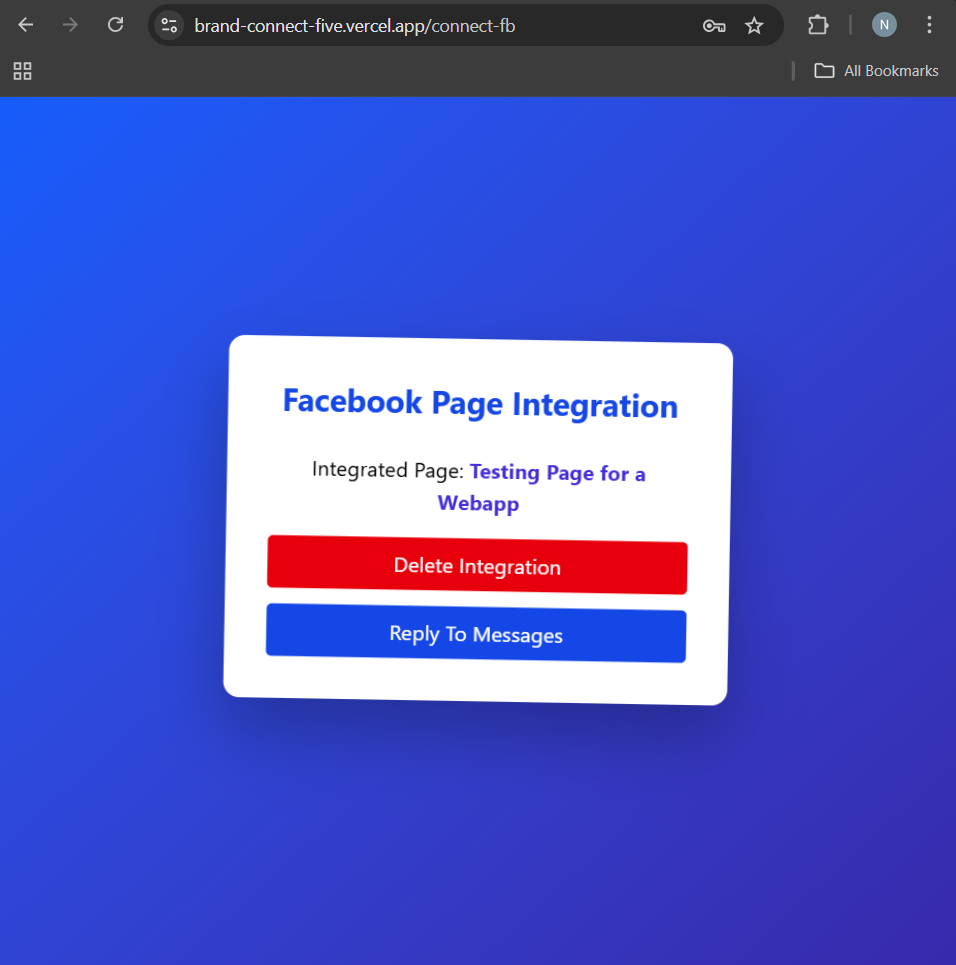

# 💬BrandConnect a Facebook Helpdesk - Messenger Support Dashboard for Business Pages

A full-stack customer support dashboard that connects to a **Facebook Page** using the **Messenger API**, allowing users to:
- View incoming messages from Facebook users.
- Reply in real-time.
- Manage conversations & customer profiles.

> 🎯 Built as a challenge submission for Richpanel hiring process.

---

## 🚀 Features

- 🔐 **User Authentication** (Register / Login)
- 📩 **Facebook Page Integration** using Graph API
- 📬 **Webhook Setup** to listen for new Messenger messages
- 💬 **Conversations View** – Load threads from customers
- ✍️ **Send Replies** – Chat via Messenger from the dashboard
- 🧾 **Customer Profile Panel** – View user info & avatar
- 💻 **Responsive & Modern UI** with TailwindCSS

---

## 📸 Demo Video (Loom)
[🔗 Click to Watch the Loom Demo](https://www.loom.com/share/c220a9c1886f437289cb8384401ba8fe?sid=dd9ffc1e-ae76-4d28-83f5-e863d265b866) <!-- Replace with actual Loom link -->

---

## 🌐 Live Application
[🔗 Deployed on Vercel](https://brand-connect-five.vercel.app/) <!-- Replace with Vercel URL -->

---

## 📦 Tech Stack

| Frontend       | Backend         | Tools & DB         |
|----------------|------------------|--------------------|
| ReactJS        | Node.js (Express) | MongoDB (Mongoose) |
| TailwindCSS    | Axios             | Facebook Graph API |
| React Router   | JWT Auth          | Ngrok (for local testing) |

---

## 🛠️ Setup Instructions

### 1. Clone the repository
```bash
git clone https://github.com/yourusername/facebook-helpdesk.git
cd facebook-helpdesk
cd server
npm install

Create a .env file:
PORT=5000
MONGO_URI=your_mongodb_connection_string
JWT_SECRET=your_jwt_secret
FB_VERIFY_TOKEN=your_facebook_verify_token
FB_APP_SECRET=your_app_secret
FB_PAGE_ACCESS_TOKEN=your_page_token
Then:
npm run dev
```

# Setup the Frontend
cd client
npm install
npm run dev

# Facebook Webhook Setup
1. Create a Facebook Page.

2. Create a Facebook App on Meta for Developers.

3. Add Messenger product and setup Webhooks.

4. Use Ngrok to expose your local backend:
ngrok http 5000
5. Add your verify token, callback URL, and subscribe to:

messages

messaging_postbacks

6. Enable Page Subscriptions and generate a Page Access Token.

## 📸 Screenshots

Below are a series of screenshots from the application:

### Login Page


### Sign Up Page


### FB Connection Page


### Disconecting the FB Page from the app


### Connect FB Page


### FB Login and Register


### Conecting Business page with the BrandConnect WebApp


### No Conversation for a new Page with no messages


### Customer messages displayed on FB page


### Sending Messages to Customers With BrandConnect WebApp

----

## ✅ What Sets This Apart
Built from scratch using Meta's Messenger Graph API.

Clean, modular codebase with component-based structure.

Flexible for future upgrades: AI reply suggestions, tagging, assigning agents, etc.

Fully responsive design, optimized for practical customer support use.


## 🧑‍💻 Author
# Nayan Kathait

📧 nayankathait@gmail.com

----
